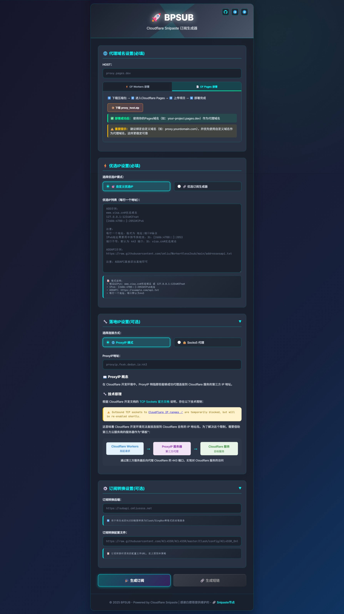

# 🚀 BPSUB - Cloudflare Snipaste 订阅生成器


[](https://workers.cloudflare.com/)
[](https://t.me/bestip_one)

> **一个运行在 Cloudflare Workers 上的 Snipaste 订阅生成器，专为白嫖哥节点服务优化**

## ✨ 项目简介

CF-Workers-BPSUB 是一个基于 Cloudflare Workers 的轻量级 VLESS 代理订阅生成器。它能够：

- 🌐 **智能节点管理**：自动获取白嫖哥提供的高质量节点
- 🔄 **多格式支持**：支持生成 Clash、SingBox、V2Ray 等多种客户端格式
- 📱 **用户友好**：提供美观的 Web 界面和二维码分享功能  
- ⚡ **高性能**：基于 Cloudflare 全球 CDN，响应速度极快
- 🛡️ **安全稳定**：支持 TLS 加密和多种传输协议

## 🎯 核心功能

### 订阅生成
- **智能优选IP**：支持自定义优选IP列表，提升连接质量
- **批量节点**：一键获取多个高质量节点
- **格式转换**：自动适配不同客户端的订阅格式

### 高级配置
- **代理IP设置**：自定义代理IP，优化网络路径
- **订阅转换**：集成订阅转换服务，支持规则分流
- **环境变量**：通过环境变量灵活配置各项参数

### 用户体验
- **响应式界面**：适配桌面和移动设备
- **一键复制**：快速复制订阅链接
- **二维码生成**：手机扫码快速导入

## 🚀 快速开始

### 1. 部署到 Cloudflare Workers
1. 访问 [Cloudflare Workers 控制台](https://dash.cloudflare.com/workers)
2. 创建新的 Worker
3. 复制 `_worker.js` 中的代码到 Worker 编辑器
4. 保存并部署

### 2. 配置环境变量（可选）

在 Cloudflare Workers 控制台的「设置」→「变量」中添加：

| 变量名 | 说明 |  示例 |
|--------|------|---------------|
| `HOST` | 可内置白嫖反代HOST，多元素使用`换行`或`,`做间隔 | `baipiao.cmliussss.abrdns.com` |
| `SUBAPI` | 订阅转换后端地址 | `SUBAPI.CMLiussss.net` |
| `SUBCONFIG` | 订阅转换配置文件 | `https://example.com/config.ini` |
| `PROXYIP` | 默认代理IP地址 |  `proxyip.fxxk.dedyn.io:443` |
| `ADD` | 默认优选IP列表，多元素使用`换行`或`,`做间隔 | `1.1.1.1:443#CF`,`8.8.8.8:443#Google` |
| `SUBNAME` | 订阅文件名称 |  `BPSUB` |
| `PS` | 节点备注后缀 | `感谢白嫖哥` |

## 📖 使用指南

### 基础使用

1. **访问 Web 界面**
   ```
   https://your-worker.your-subdomain.workers.dev/
   ```

2. **生成订阅链接**
   - 在界面中配置优选IP列表
   - 设置代理参数（可选）
   - 点击「生成订阅链接」

3. **导入客户端**
   - 复制生成的订阅链接
   - 在代理客户端中添加订阅
   - 或扫描二维码快速导入

### API 使用

#### 获取订阅
```bash
# 基础订阅（Base64编码）
curl "https://your-worker.workers.dev/sub"

# 自定义优选IP
curl "https://your-worker.workers.dev/sub?ips=1.1.1.1:443#CF|8.8.8.8:443#Google"

# 设置代理IP  
curl "https://your-worker.workers.dev/sub?proxyip=cdn.example.com:443"

# Clash 格式（需要 UA 包含 clash）
curl -H "User-Agent: clash" "https://your-worker.workers.dev/sub"
```

#### 获取节点数据
```bash
# 查看原始节点数据
curl "https://your-worker.workers.dev/uuid.json"
```

### 高级配置

#### 优选IP格式
```
# 基本格式
域名或IP:端口#备注

# 示例
visa.cn#优选域名
127.0.0.1:1234#本地测试  
[2606:4700::]:2053#IPv6地址

# API 格式（自动获取IP列表）
https://example.com/api/ips.txt
```

#### SOCKS5 代理
```bash
# 单个节点使用 SOCKS5
curl "https://your-worker.workers.dev/sub?socks5=127.0.0.1:1080"

# 全局 SOCKS5 代理
curl "https://your-worker.workers.dev/sub?socks5=127.0.0.1:1080&global=true"
```

## 🛠️ 开发指南

### 本地开发

```bash
# 安装依赖
npm install

# 启动开发服务器
npm run dev

# 本地访问
# http://localhost:8787
```

### 项目结构

```
CF-Workers-BPSUB/
├── _worker.js          # 主要业务逻辑
├── package.json        # 项目配置和依赖
├── wrangler.toml       # Wrangler 配置文件
└── README.md          # 项目文档
```

### 核心模块

- **订阅生成**：处理 VLESS 链接生成和格式转换
- **节点获取**：从白嫖哥 API 获取可用节点信息
- **优选IP处理**：解析和管理用户自定义的优选IP列表
- **Web界面**：提供用户友好的配置和管理界面

## 📋 客户端兼容性

### 完全支持
- ✅ **V2Ray** / V2RayN / V2RayNG
- ✅ **Clash** / Clash for Windows / ClashX
- ✅ **SingBox** / SFI
- ✅ **Shadowrocket** (iOS)

### 自动识别
程序会根据客户端 User-Agent 自动选择最佳订阅格式：
- `clash` → Clash 格式
- `sing-box` → SingBox 格式  
- `v2ray` → V2Ray 格式
- 其他 → 自动检测

## 🔧 故障排除

### 常见问题

**Q: 订阅链接无法访问？**
A: 检查 Worker 域名是否正确，确认服务已成功部署

**Q: 节点连接失败？**  
A: 尝试更换优选IP，或检查本地网络环境

**Q: 订阅转换失败？**
A: 检查 `SUBAPI` 环境变量是否配置正确

**Q: 如何自定义节点备注？**
A: 设置 `PS` 环境变量，或在优选IP中使用 `#备注` 格式

### 调试技巧

1. **查看节点数据**：访问 `/uuid.json` 端点
2. **检查环境变量**：在 Workers 控制台确认配置
3. **使用开发模式**：`npm run dev` 本地调试

## 🤝 贡献指南

欢迎提交 Issue 和 Pull Request！

1. Fork 本仓库
2. 创建特性分支：`git checkout -b feature/amazing-feature`
3. 提交更改：`git commit -m 'Add amazing feature'`
4. 推送分支：`git push origin feature/amazing-feature`
5. 提交 Pull Request

## 📞 支持与反馈

- 🐛 **Bug 报告**：[GitHub Issues](https://github.com/cmliu/CF-Workers-BPSUB/issues)
- 💡 **功能建议**：[GitHub Discussions](https://github.com/cmliu/CF-Workers-BPSUB/discussions)  
- 📢 **交流群组**：[白嫖哥频道](https://t.me/bestip_one)

## 🙏 致谢

- **Cloudflare Workers**：提供优秀的 Serverless 平台
- **[白嫖哥](https://t.me/bestip_one)**：提供高质量的免费节点服务
- ~~fftk~~
- [肥羊短链](https://suburl.v1.mk/)：感谢提供免费短链服务